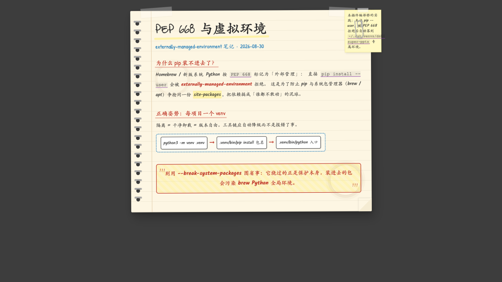
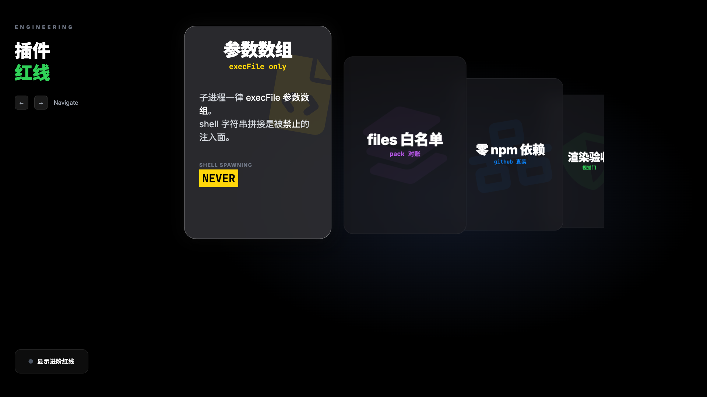
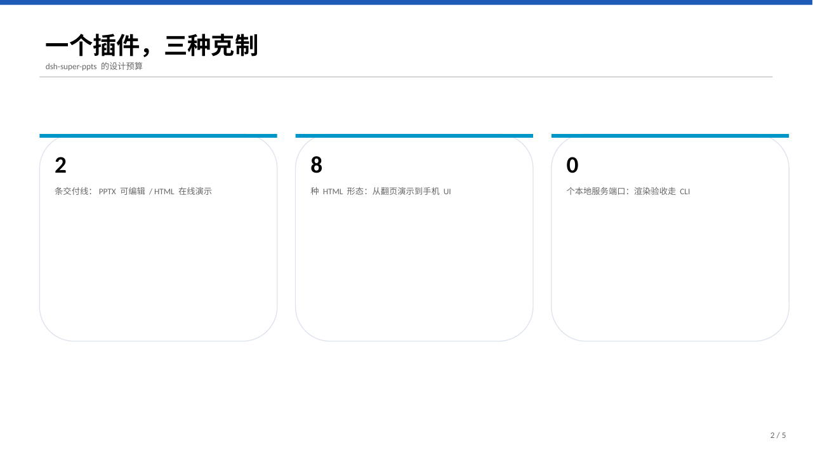
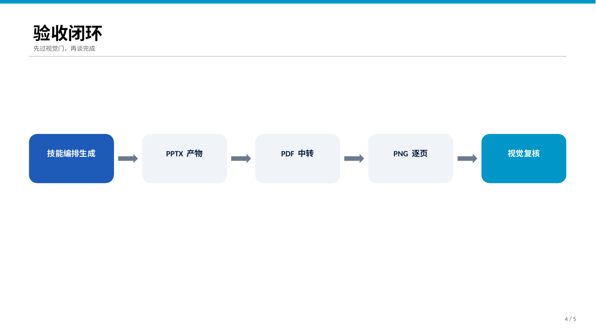

# dsh-super-ppts

**DSH 原生演示文稿超级插件**：一个插件交付两种演示形态——可编辑 PPTX 与
HTML 在线演示，统一「设计导演」工作流与渲染验收闭环。

**DSH native presentation super-plugin**: one plugin, two delivery formats —
editable PPTX and self-contained HTML presentations, unified under a
design-director workflow with render-review loops.

## 安装 / Install

```bash
# GitHub 直装 / install straight from GitHub
dsh plugin --profile web add github:kkutysllb/dsh-super-ppts

# 或从 dsh-plugins 真源仓 / or from the dsh-plugins monorepo
dsh plugin --profile web add github:kkutysllb/dsh-plugins#dsh-super-ppts
```

装好后切换 Agent 预设「**演示文稿专家**」即可开始（也可不切预设，直接在
对话里说需求，能力通告会引导路由）。

Switch to the **Presentation Expert** agent preset after install — or just
state your request; the capability announcement routes it.

## 双交付形态 / Two delivery formats

### 1. 可编辑 PPTX / Editable PPTX（skills/ppts-pptx）

引擎为 PyPI 公共库 `pptx-designer`。设计导演七步工作流：Brief 契约 →
视觉预检 → 页面规划 → 视觉方向锁定 → 生成路径（Build Mode / FreeStyle /
VI Build 企业模板）→ 构建检视循环 → 用户确认。每轮修订都跑
**PPTX → PDF → PNG 渲染验收**，交付级任务不得跳过。

Engine: the public `pptx-designer` Python library. A seven-step
design-director workflow with mandatory PPTX → PDF → PNG render review
before delivery. Three modes: Build Mode (element-level control),
FreeStyle (fast path), and VI Build (enterprise template compliance).

### 2. HTML 在线演示 / HTML presentations（skills/ppts-html）

单文件自包含 HTML，浏览器直接打开即交付。8 种形态 / 8 forms:

| 形态 Form | 目录 | 适用 |
|---|---|---|
| 翻页演示 Slide deck | `skills/ppts-html/forms/slide-deck` | 视频科普、技术讲解、教学 |
| 流程原理图 Flowchart | `skills/ppts-html/forms/flowchart` | 教育/科普流程与模型原理（AI/ML 子集） |
| 协议可视化 Protocol viz | `skills/ppts-html/forms/protocol-viz` | TCP/IP、TLS 等协议结构与交互 |
| 工程架构图 Arch diagram | `skills/ppts-html/forms/arch-diagram` | 架构/时序/状态机/数据流，可导出 PNG/SVG/GIF/WebM |
| 3D 卡片剧场 Card theater | `skills/ppts-html/forms/card-theater` | 叙事式分步讲解、模式对比 |
| 手写笔记 Scholar notes | `skills/ppts-html/forms/scholar-notes` | 手写本风格学习笔记 |
| 电影化分镜 Video shots | `skills/ppts-html/forms/video-shots` | 成片级分镜演示（双角色立绘体系） |
| 手机系统 UI Phone UI | `skills/ppts-html/forms/phone-ui` | 把产品做成「真手机录屏」演示 |

## 效果展示 / Showcase

以下均由本插件技能线实际生成（源文件在 [`demos/`](demos/) ，clone 后直接用浏览器打开即可体验；
PPTX 样例可用 [`demos/build-pptx-demo.py`](demos/build-pptx-demo.py) 本地重放）。
All demos below were generated by this plugin's skill lines (open the files under
[`demos/`](demos/) in a browser; replay the PPTX sample locally with `demos/build-pptx-demo.py`).

**HTML 线 / HTML line**

| 翻页演示 Slide deck（warm-paper 报纸风） | 手写笔记 Scholar notes |
|---|---|
|  |  |
| **3D 卡片剧场 Card theater（coverflow）** | |
|  | |

**PPTX 线 / PPTX line**（Build Mode + 渲染验收 / Build Mode with render review）

| 关键数字页 KPI | 验收闭环页 Review loop |
|---|---|
|  |  |

## 原生工具 / Native tools

| 工具 | 作用 |
|---|---|
| `ppts_check` | 环境自检：Python ≥3.10 / pptx-designer / 渲染链（soffice + pdftoppm） |
| `ppts_render` | PPTX → PDF → PNG 渲染验收（跨平台；Win COM 可选加速路径见脚本） |

生成主体由技能编排（agent 直跑 Python / 写 HTML），host 侧零本地服务、
零端口占用。

Generation is orchestrated by the skills (the agent runs Python / writes
HTML directly); the host side runs zero local services and listens on no
ports.

## 环境要求 / Requirements

- **PPTX 线**：Python ≥ 3.10 + pip（`pptx-designer` 由编译桥自动安装）；
  渲染验收可选 LibreOffice（soffice）+ poppler（pdftoppm）——
  macOS `brew install --cask libreoffice poppler`。
  PPTX line: Python ≥ 3.10 with pip (`pptx-designer` auto-installed);
  render review optionally uses LibreOffice + poppler.
- **HTML 线**：现代浏览器即可；无头截图质检需 Node ≥ 18
  （`skills/ppts-html/forms/video-shots/scripts/shot.js`）。
  HTML line: any modern browser; headless screenshot QC needs Node ≥ 18.
- 全平台可用（macOS / Linux / Windows）；平台差异由脚本内探测处理。

## 目录结构 / Layout

```
dsh-super-ppts/
├── package.json          # dsh manifest（bundle patch + client inject[web]）
├── cordis.patch.yml      # 插件注册 patch
├── src/                  # Host 壳源码（预设安装 + 能力通告 + 工具注册）
├── lib/                  # 预编译产物（client.js 为手写自注册壳）
├── compiler/build_pptx.py        # pptx-designer 编译桥（--check/--ensure-deps/--run/--quick）
├── presets/              # 「演示文稿专家」Agent 预设（双形态路由）
├── demos/                # 实机样例（README 展示图的源文件 + PPTX 生成脚本）
└── skills/
    ├── ppts-pptx/        # PPTX 交付线（SKILL.md + references + 渲染脚本）
    ├── ppts-html/        # HTML 交付线（入口 + forms/ 8 形态）
    └── shared/           # 双线共享设计 token
```

## 致谢 / Credits

- [PPT-Design-Skill](https://github.com/z953218350) — PPTX 设计方法论底料（MIT）
- [KAnimation](https://github.com/z953218350) — 8 个 HTML 形态技能底料（MIT）；
  其中 scholar-notes © UncleCheng（MIT）、arch-diagram 基于
  tt-a1i/Archify（MIT，原 Cocoon-AI/architecture-diagram-generator，MIT）
- [dsh-np-ppt](https://github.com/z953218350/dsh-np-ppt) — dsh 插件工程形态参考

以上素材均已按本插件架构重构（原目录结构不保留）；各素材 LICENSE 随对应
目录分发。All upstream material was re-architected for this plugin; licenses
ship alongside the respective directories.

## License

MIT
